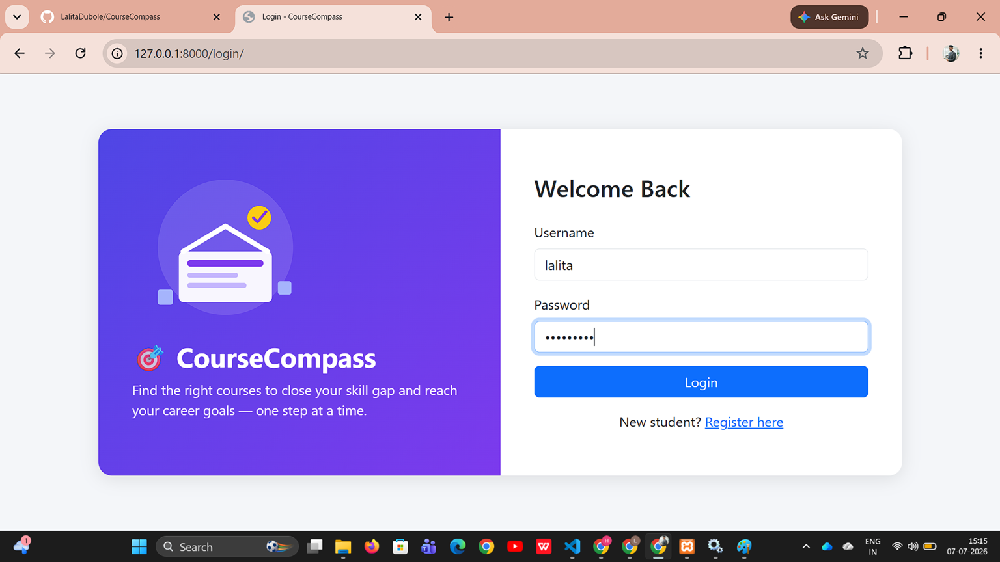
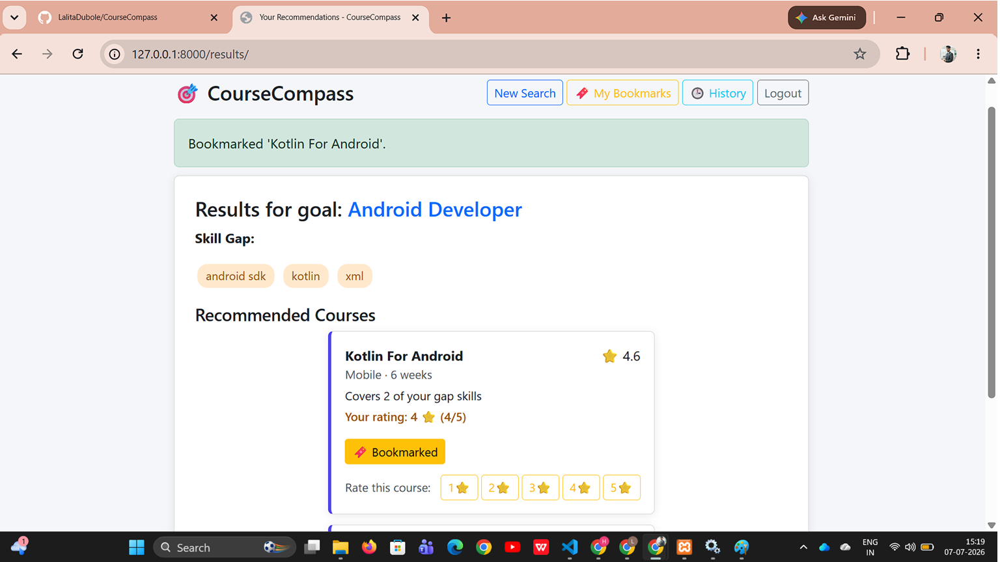
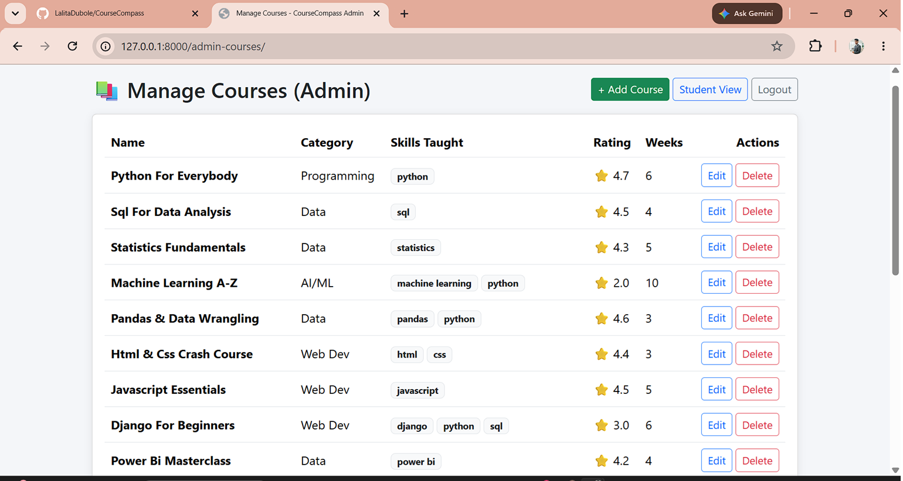

# 🎯 CourseCompass

A course recommendation system I built for my Python/Django project (Roll No. 17) — it looks at what career you want and what skills you already have, figures out what's missing, and suggests courses to fill that gap.

---

## What it does

I wanted to build something more than just a basic CRUD app, so CourseCompass actually:

- Lets students register/login
- Takes a career goal (like "Data Scientist") + your current skills
- Works out the skill gap using set operations
- Searches the course catalog **in parallel using threading** (splits the catalog into chunks across 4 threads)
- Ranks the results by how many gap-skills they cover + rating
- Lets you bookmark courses and rate them
- Keeps a history of every search you've done
- Has a separate admin panel (staff-only) to add/edit/delete courses
- Also exposes a REST API (built with DRF) for the same recommendation logic

---

## Tech I used

- **Python 3.13**
- **Django 6.0** for the web app
- **MongoDB Atlas** for storing courses, users, bookmarks, ratings
- **Django REST Framework** for the API
- **Bootstrap 5** for styling (kept it simple)

---

## Screenshots

| Login | Recommendations | Admin Dashboard |
|---|---|---|
|  |  |  |

---

## How the recommendation logic works

1. Student enters career goal + current skills
2. `required_skills - current_skills` (set difference) gives the skill gap
3. The full course catalog gets split into 4 chunks, and each chunk is searched in its own thread at the same time (instead of one after another) — this is where I used the `threading` module
4. All the matches get merged and sorted by `(gap_coverage, rating)` using a lambda
5. The search gets logged into the student's learning history in MongoDB

---

## Project structure
---

## Running it locally

```bash
git clone https://github.com/YOUR_USERNAME/CourseCompass.git
cd CourseCompass

python -m venv venv
venv\Scripts\activate

pip install -r requirements.txt

# create a .env file with:
# MONGO_URI=your_mongodb_connection_string
# MONGO_DB_NAME=coursecompass_db
# DJANGO_SECRET_KEY=your_secret_key

python manage.py migrate
python manage.py seed_courses
python manage.py createsuperuser
python manage.py runserver
```

Then open `http://127.0.0.1:8000/`

---

## Assignment mapping (Units 1-5)

| Unit | What I covered | Where |
|---|---|---|
| U1 – Fundamentals | dicts, sets, list comprehensions | `core_logic.py` |
| U2 – Functions & Modules | custom exceptions, lambda sorting | `exceptions.py`, `recommender_engine.py` |
| U3 – OOP / Regex / Threading | classes, regex, threading | `classes.py` |
| U4 – MongoDB | CRUD, query by skill | `mongo.py` |
| U5 – Django | forms, views, DRF API | `views.py`, `forms.py`, templates |

---

## What I learned building this

## What I learned building this

## What I learned building this

First problem I hit was `python` not working in PowerShell at all — turns out I had to actually install it from python.org and tick "Add to PATH", since the default Windows shortcut just tries to open the Microsoft Store lol.

Also had an annoying bug where after logging in as admin, I'd have to manually type the `/admin-courses/` URL every single time instead of it just taking me there. Fixed it by checking if the user is staff right after login and redirecting them straight to the admin page instead of the normal student form.

GitHub was being weird too — VS Code kept trying to push using some old account instead of mine. Turned out Windows had an old login saved in Credential Manager, so I had to delete that before it let me sign in properly.

And a small one — my rating buttons (1 to 5) looked like a random pile of stars stuck together at first, no spacing or anything. Just gave each button its own outline so you can actually tell them apart now.